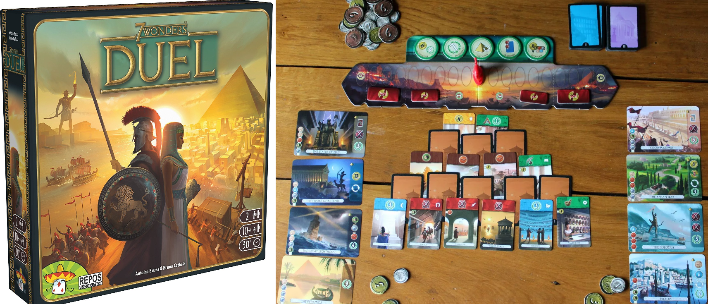
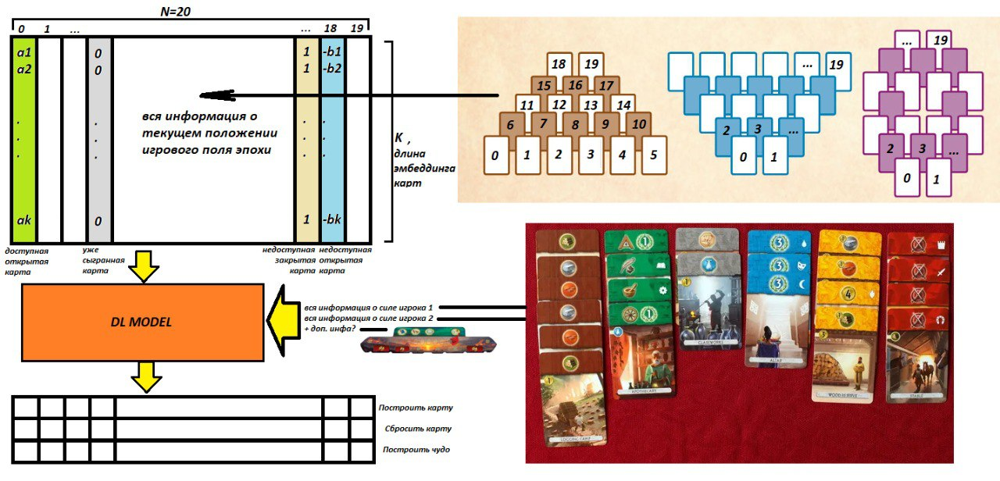

## RL agent for board card game «7 Wonders: Duel»

We present our bot (based on reinforcement learning algorithms) for board card game «7 Wonders: Duel» embedded in this [online platform](https://7wd.io/welcome).
Our approach is similar to the [DeepMind's AlphaGo solution](https://www.youtube.com/watch?v=Z1BELqFQZVM&ab_channel=TheAIEpiphany):
we use Monte Carlo Tree Search (MCTS) with Behavior Cloning (BC) learners.

## Requirements

1. Clone https://github.com/dfomin/7wd-engine
2. Add 7wd-engine to PYTHONPATH or add the path to jupyter notebook
3. Python 3.9+ is supported

## Data

Data for BC can be downloaded here:

https://drive.google.com/file/d/1qi3QEYamKcGypw0HPhwI5L0mwHWHR6EP/view?usp=sharing
https://drive.google.com/file/d/1b0mVKbzh60L3hjPX0lvt-n03IyphTquI/view?usp=sharing
